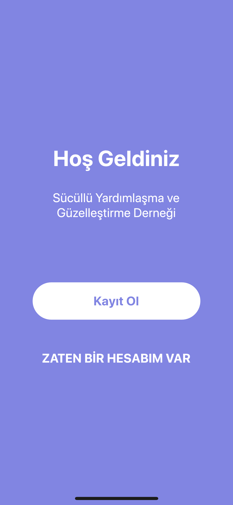
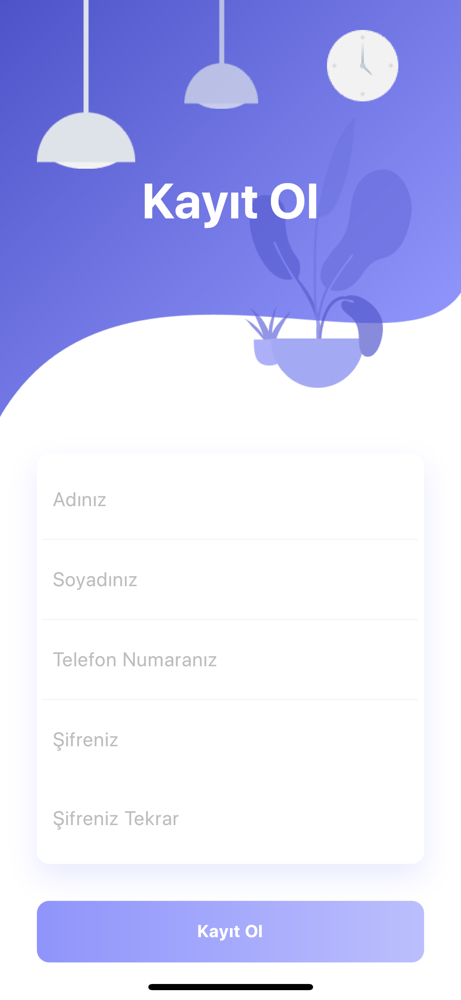
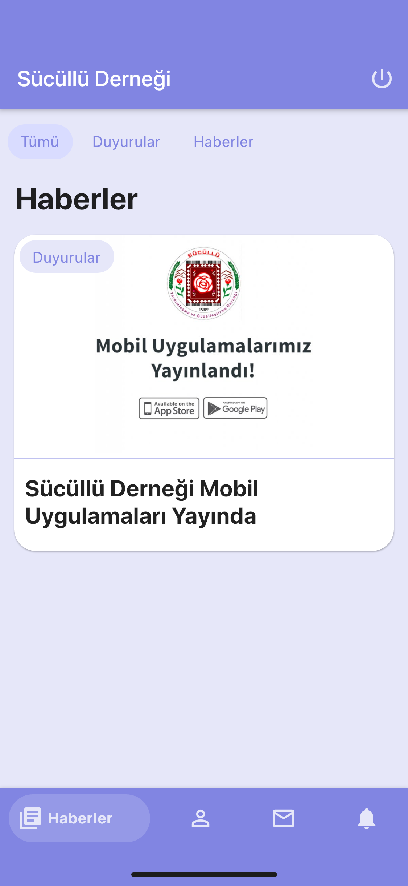
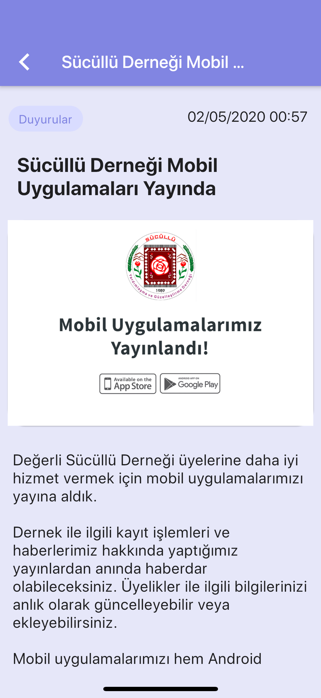
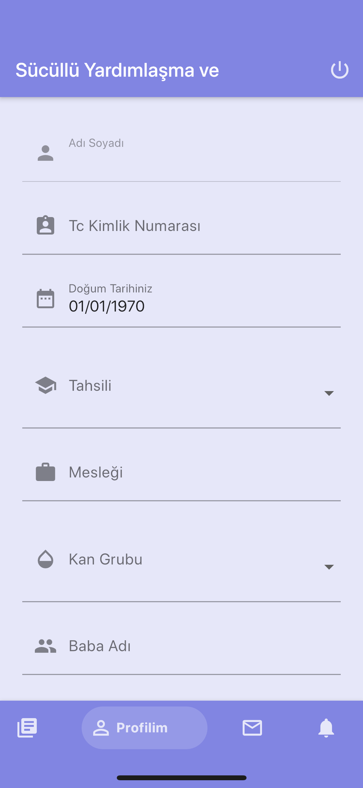
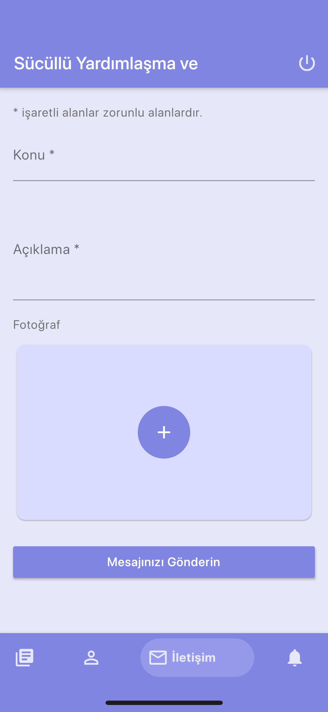
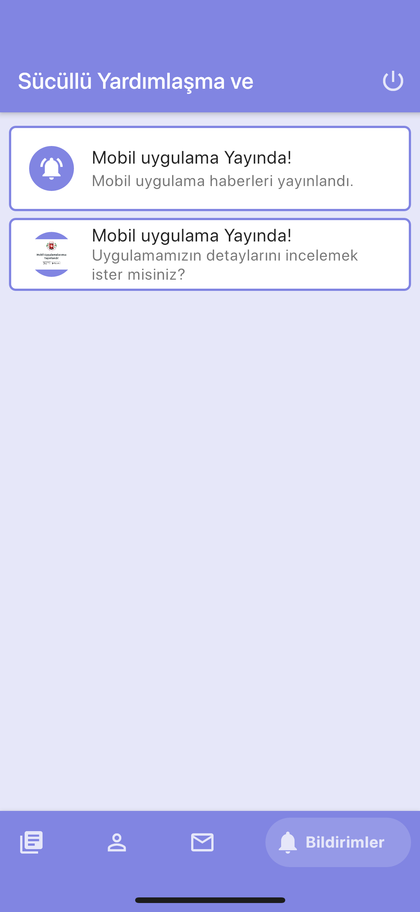

# Dernek Uygulaması (Mobil)

## Hakında
* Bu bir flutter projesidir
* [PHP ile yazılmış web servis](https://github.com/bayramlcm/dernekAppBackend) ile iletişim kurarak çalışmaktadır
* Kullanıcı bilgileri, haberler ve bildirim gönderilmek üzere tasarlanmıştır
* Hem Android hem de IOS için kararlı sürümdür ve çalışmaktadır

### Çalıştırma
* <code>lib/bin/config.dart</code> apiUrl alanının düzenlenmesi gerekmektedir.
* <code>lib/bin/theme.dart</code> Tema isteğe bağlı renklendirebilir, yapı dinamiktir
* Firebase ayarları yapılması gerekmektedir.

## Ekran Görüntüleri

### Landing Page

### Register Page

### Login Page

### News Page

### New Detail Page

### Profile Page

### Contact Page

### Notification Page

